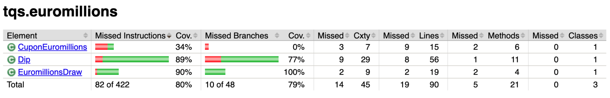
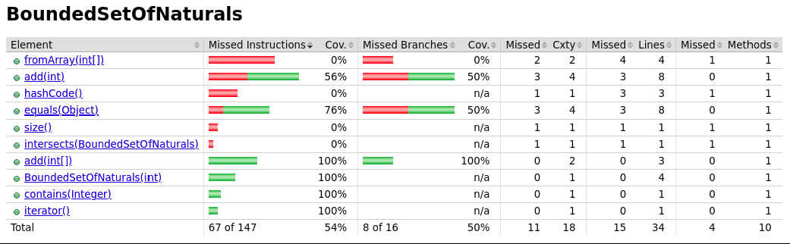
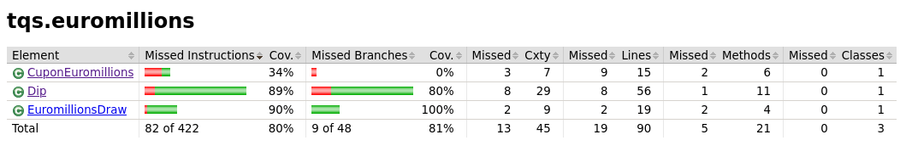
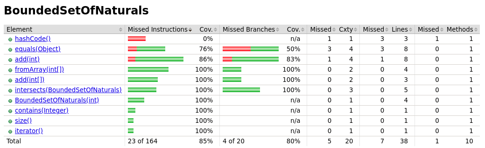

# EuroMillions

## Obtained Results

### Which classes/methods offer less coverage? Are all possible [decision] branches being covered?

The class that offers less coverage is `CouponEuromillions` with only 34% coverage. The main reason for this is that
the `format()` method has not been tested in any of the unit tests written. The `Dip` class currently has a coverage of
89%, but it's not at 100% because the auto-generated methods have not been tested and some of the decision branches have
not been completely covered.

As we can see, a significant portion of the code is currently covered by the tests that have been written.