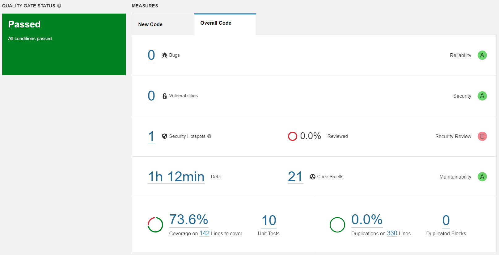

# EuroMillions

## Review Questions

### Has your project passed the defined quality gate?

This project has successfully passed the defined quality gate, which ensures that the project meets the predefined
standards and quality criteria set for it. However, during the code analysis using Sonarqube, we have identified some
issues that need attention.

The code analysis identified 1 possible security hotspot and 21 code smells in the project. A security hotspot
is a potential security vulnerability that requires attention to prevent security breaches. On the other hand, code
smells are not necessarily bugs or defects, but they indicate poor code design or structure that can lead to maintenance
issues and future bugs.

The total debt time of 1h12m refers to the estimated time required to fix all the issues found by Sonarqube. The time
required to fix the detected issues depends on the complexity of the code, the scope of the changes, and the required
testing.

### Explore the analysis results and complete with a few sample issues, as applicable.

| Issue              | Problem description                                                                      | How to solve                                                                           |
|--------------------|------------------------------------------------------------------------------------------|----------------------------------------------------------------------------------------|
| Bug                | -                                                                                        | -                                                                                      |
| Vulnerability      | -                                                                                        | -                                                                                      |
| Security Hotspots  | Pseudorandom number generators usage is security-sensitive.                              | Consider using a more robust random number generator with good cryptographic strength. |
| Code smell (major) | Invoke method(s) only conditionally.                                                     | Consider only call the method(s) conditionally by checking the appropriate conditions. |   
| Code smell (major) | Refactor the code in order to not assign to this loop counter from within the loop body. | Consider not update the counter in the body of the loop.                               |        
