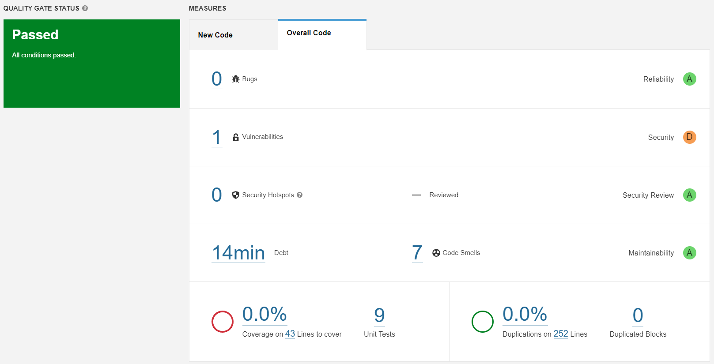
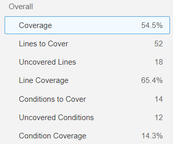

# Cars

## Review Questions

### Take note of the technical debt found. Explain what this value means.

The SonarQube analysis showed a technical debt of 14 minutes in my project, indicating that there are code issues that
need to be fixed. The debt time represents the estimated amount of time required to address all of the identified
issues.

### How many lines are “not covered”? And how many conditions?

