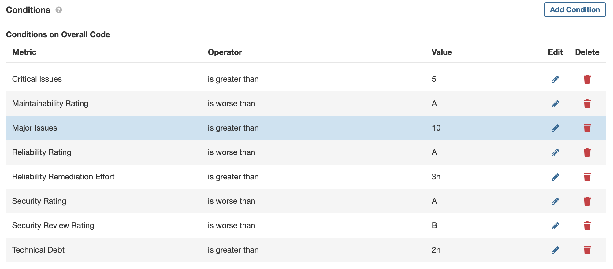
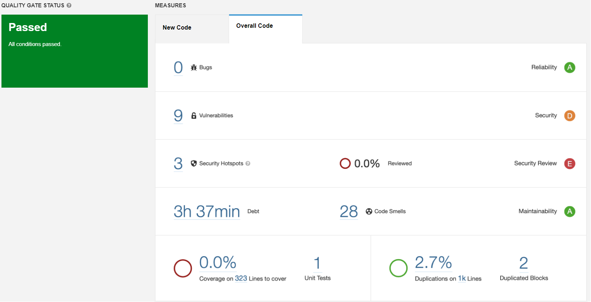
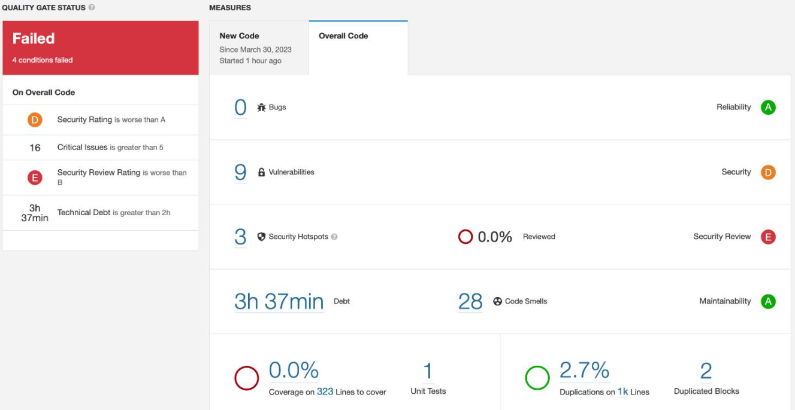

# Custom QG

## Review Questions

### Define a custom quality gate to this project. Feel free to mix the metrics but explain your chosen configuration.

I tested it on my IES project.

- Maintainability Rating is worse than A: Our code should be easy to update and fix, and the threshold is set at A because it represents a desirable level of maintainability for the code.
- Reliability Rating is worse than A: If the reliability rating is worse than A, it could mean that the code has defects that might cause problems or errors in the system.
- Reliability Remediation Effort is greater than 3h: We set this threshold because we believe that any issues with the code should be resolved immediately.
- Security Rating is worse than A: The code should be free of vulnerabilities that hackers could exploit, putting the system and its users at risk.
- Security Review Rating is worse than B: A thorough security review is essential to ensure the code is as secure as possible.
- Critical Issues is greater than 5: If the code has more than 5 critical issues, it could indicate that the system is at risk of serious problems or security breaches.
- Major Issues is greater than 10: A code with more than 10 major issues indicates that there are too many significant problems that could make it harder to understand and improve the system.
- Technical Debt is greater than 2h: It's important to address technical debt promptly (stop stacking problems).

## Image Reports

### Default Quality Gate

### Custom Quality Gate

This exercise was done with the help of my colleague [Gabriel Hall](https://github.com/GabrielHall02).
